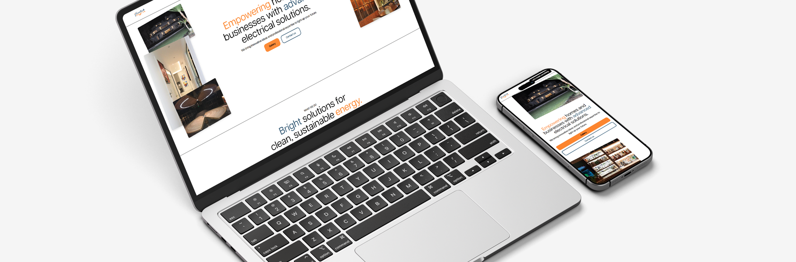

# iLight Remake

[Live Demo](https://sramoras.github.io/ilight/)

## About the Project

iLight Remake is a modern reinterpretation of the original website [ilight.pt](https://ilight.pt/). This project was built using React and GSAP to replicate and enhance the unique visual and interactive experience of the original site. The goal is to bring a contemporary touch to the design while preserving the essence of the brand.

## Project Goals and Vision

- **Enhance User Experience:** Leverage advanced animations with GSAP to deliver a smooth and engaging interface.
- **Modernize the Design:** Update the visual layout using React and Vite, ensuring fast loading times and a responsive design.
- **Preserve Brand Identity:** Maintain the core elements and feel of the original iLight website while infusing modern techniques.
- **Seamless Navigation:** Implement hash-based routing with React Router for efficient navigation, especially suited for GitHub Pages deployment.

## Technologies Used

- **React:** Main framework for building the user interface.
- **Vite:** A fast and optimized build and development tool.
- **GSAP (GreenSock Animation Platform):** Library for creating advanced, high-performance animations.
- **React Router:** Manages routing using hash-based navigation for better compatibility with GitHub Pages.
- **gh-pages:** Automates deployment on GitHub Pages.

## How to Run Locally

### Prerequisites

- Node.js (LTS version recommended)
- npm or Yarn

### Installation

1. Clone the repository:
   ```bash
   git clone https://github.com/your-username/ilight.git
   cd ilight
